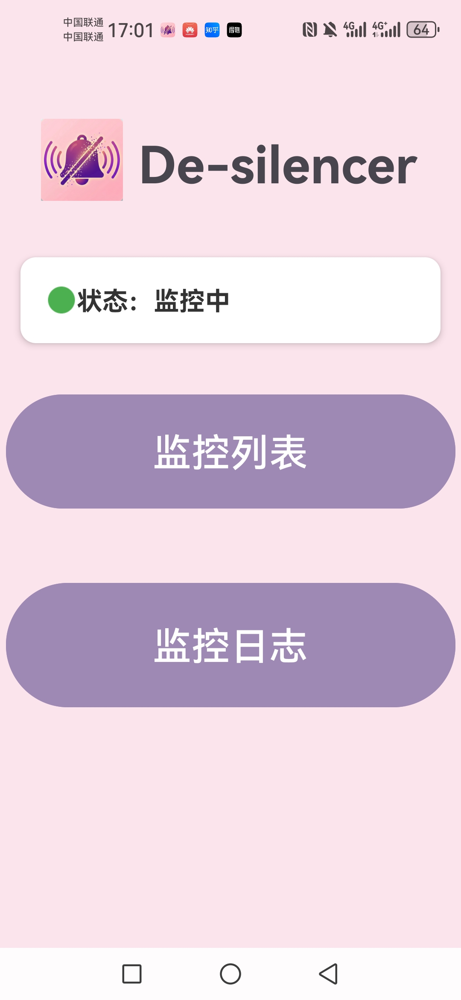
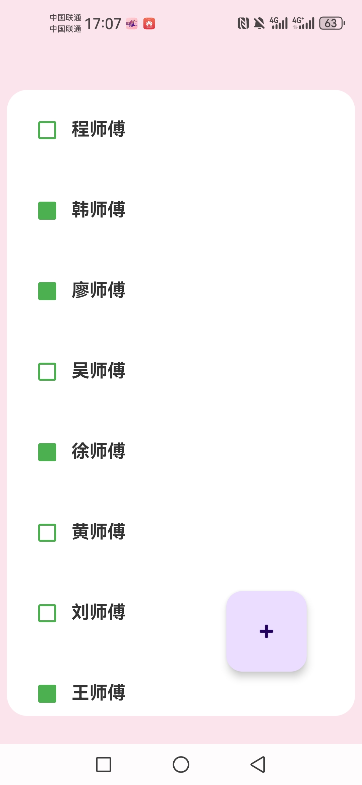
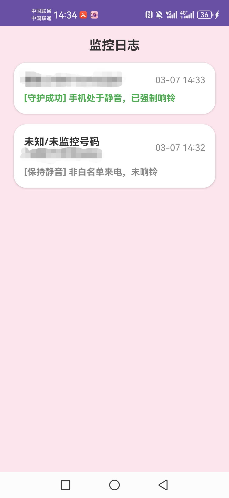

# De-silencer (静音守护助手) 🛡️

**De-silencer** 是一款基于 Android 平台的轻量级通讯辅助工具。它的核心使命是：**在手机处于静音或勿扰模式下，依然确保你不会漏接来自家人、重要客户或紧急联系人的来电。** 通过建立本地白名单，App 会在后台智能监听来电。当识别到白名单号码时，系统将自动破除静音模式并响铃，通话结束后自动恢复原状，实现真正的“无痕守护”。

## ✨ 核心功能 (Features)

* **🛡️ 智能白名单拦截：** 本地持久化存储核心联系人，无网环境下依然稳定工作。
* **🔊 自动破除静音：** 深度调用系统 `AudioManager`，无视静音/震动状态，强制为特定号码响铃。
* **🔄 状态无痕恢复：** 挂断电话后，自动将手机恢复至来电前的静音或震动状态。
* **📝 便捷名单管理：** 支持从系统通讯录导入，或手动快捷添加并一键反向同步至系统通讯录。
* **🔋 极低后台功耗：** 采用 Android 前台服务 (Foreground Service) 结合动态广播接收器，兼顾保活率与省电。

## 🛠️ 技术栈 (Tech Stack)

本项目采用现代 Android 开发架构构建：
* **语言：** Kotlin
* **异步处理：** Kotlin Coroutines (协程) 保证数据库读写不阻塞主线程。
* **UI 视图：** RecyclerView + 自定义 Adapter，实现数据列表的丝滑更新。
* **本地存储：** Room 数据库 (基于新一代 KSP 注解处理器)，实现安全高效的本地数据持久化。
* **核心组件：** BroadcastReceiver (广播接收器), Foreground Service (前台服务)。

## 📸 界面预览 (Screenshots)
<div align="center">
  
  
  
</div>

## ⚙️ 运行与编译环境 (Requirements)

* **Minimum SDK:** Android 8.0 (API Level 26) 及以上
* **必要硬件:** 具备 SIM 卡插槽并支持蜂窝网络通话的智能设备。
* **核心权限声明:**
  * `READ_CONTACTS` / `WRITE_CONTACTS`: 同步与读取通讯录。
  * `READ_PHONE_STATE`: 监听来电状态。
  * `ACCESS_NOTIFICATION_POLICY`: 核心权限，用于动态修改系统的勿扰/静音模式。
  * `FOREGROUND_SERVICE`: 维持后台监听服务的存活。

## 🚀 快速开始 (Getting Started)

1. 克隆本项目到本地：
   ```bash
   git clone [https://github.com/你的用户名/De-silencer.git](https://github.com/你的用户名/De-silencer.git)
